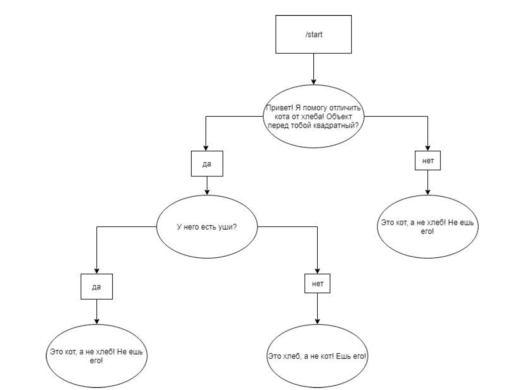

## Задание 1. BotSelector

Реализуйте бота, который поможет пользователю определить, кот перед ним или хлеб.
Сценарий бота следующий:

</details>


### О приложении

Это простое приложение, основанное на Django, которое выполняет обработку и анализ сообщений.

#### API
В данном приложении присутствует простое RESTful API, предоставляющее два эндпоинта для взаимодействия с приложением.

/start_conversation: Этот эндпоинт принимает POST-запросы и предназначен для начала новой беседы. Он ожидает параметры user_id и message, которые передаются в теле запроса. После получения запроса, функция start_conversation вызывается для обработки запроса. Она исправляет опечатки в сообщении, обрабатывает его с помощью функции process_message, сохраняет информацию о беседе в базе данных и возвращает JSON-ответ с ответом на сообщение.

/get_conversation_history: Этот эндпоинт также принимает POST-запросы и предназначен для получения истории беседы для определенного user_id. Он ожидает параметр user_id в теле запроса. После получения запроса, функция get_conversation_history вызывается для извлечения истории беседы из базы данных. Затем формируется JSON-ответ с историей беседы и возвращается клиенту.

Таким образом, клиентское приложение может отправлять POST-запросы на указанные эндпоинты с необходимыми параметрами, чтобы начать новую беседу (/start_conversation) или получить историю беседы (/get_conversation_history). Серверное приложение обрабатывает запросы, выполняет соответствующие операции, используя функции и модели, предоставленные в коде, и возвращает результаты в формате JSON.

#### DB
Еще в приложении определена модель Conversation, которая представляет сущность беседы. Она содержит следующие поля:

user_id: поле типа CharField, предназначено для хранения идентификатора пользователя, который участвует в беседе.
message: поле типа CharField, предназначено для хранения текста сообщения, отправленного пользователем.
response: поле типа CharField , предназначено для хранения текста ответа на сообщение.
timestamp: поле типа DateTimeField , предназначено для хранения временной метки создания записи.

Схема базы данных для этой программы состоит из одной таблицы с четырьмя полями. Каждая запись в таблице представляет отдельную беседу, содержащую идентификатор пользователя, текст сообщения, текст ответа и временную метку создания записи.

### Зависимости

Для запуска этого приложения вам понадобится следующее:

- Python 3.9
- Docker

### Установка

1. Клонируйте репозиторий:

   ```bash
   git clone https://github.com/NViQ/BotSelect.git
   
2. Установите зависимости:
    
    ```bash
   pip install -r requirements.txt

3. Запуск:
    
    ```bash
   docker build -t botproject .
   
   docker run -p 8000:8000 my-bot-app

### Использование

После успешного запуска приложения, вы можете взаимодействовать с ним, отправляя запросы на эндпоинты:

/start (POST): Запускает новый диалог с начальным сообщением.

/get_conversation_history (POST): Возвращает историю диалога для указанного пользователя.

/statistics (GET): Возвращает статистику по диалогам.

Примеры тестов можно найти в файле [tests.py](./bot_project/bot_app/tests.py).


## Задание 2. Реализация алгоритма.

Хотим сделать бота, который отвечает на часто задаваемые вопросы. Для этого у нас
есть какой-то чёрный ящик, который для данной реплики возвращает наиболее
подходящий ответ и score, насколько по мнению этого чёрного ящика этот ответ
подходит (от 0 до 100). При этом мы понимаем, что бот не сможет отвечать на все
вопросы, и поэтому делаем так:
1) Если бот сильно уверен в ответе (score высокий), то даём пользователю ответ
2) Если бот совсем не уверен в ответе (score низкий), то переводим пользователя
на оператора
3) Если score средний, то просим пользователя переформулировать вопрос.

Нужно выяснить, какой score считать низким, какой средним, а какой высоким. Мы
провели эксперимент: попросили живых людей задать вопрос боту, а потом указать,
что было бы правильно после такого вопроса сделать: ответить, переспросить или
перевести на оператора. Мы записали в таблицу score от чёрного ящика и
предложенное тестером действие. (table.csv)

Ваша задача - реализовать алгоритм, будет принимать на вход score и возвращать
следующее действие: вывести ответ пользователю, переспросить пользователя или
перевести на оператора. Обоснуйте, почему был выбран именно такой алгоритм и
именно такие параметры для него.
Предложите метрику для определения точности своего алгоритма и посчитайте её
значение для данных из table.csv

### Решение:

Пример алгоритма и расчета метрики по нему: [Metrics.py](./Metrics.py).

Обоснование: https://docs.google.com/document/d/11_8UONqPZlP_7zvPrDwlYa6yyqEeaEDSoqHLhYVLaK4/edit


